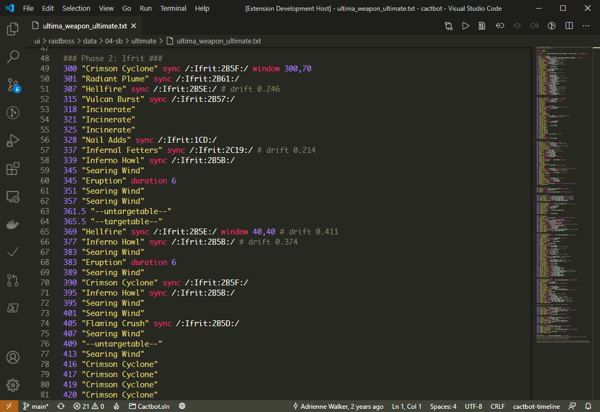
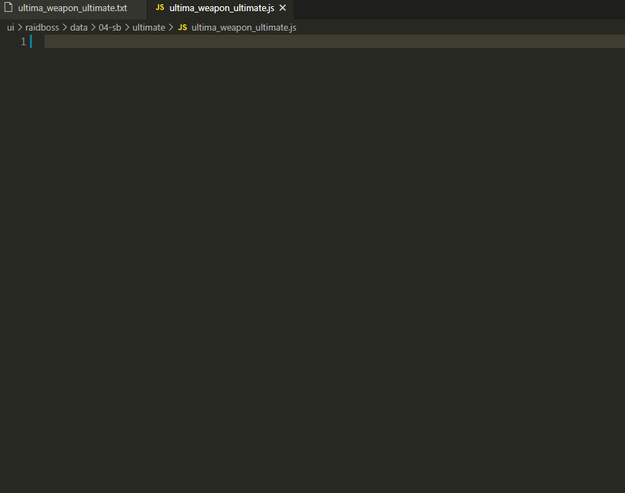

# cactbot-highlight

A custom extension for developing [cactbot](https://github.com/quisquous/cactbot/) modules.

## Features

### timeline highlight



> uwu timeline with Monakai color theme

### useful snippets

> snippets in trigger.js files



## Install

### Install from VSIX

- Download the latest release `cactbot-highlight-x.x.x.vsix` from [Release](https://github.com/MaikoTan/cactbot-highlight/releases)

- Launch VSCode and switch to `Extensions` tab

- Click the `Views and More Actions...` (3-dots) button, select `Install from VSIX...`

- Enjoy ~

### Install from source code

- Download source code

- Copy the whole directory to your extensions root:

  - Linux / OS X: `~/.vscode/extensions/`
  - Windows: `C:\Users\your-name\.vscode\extensions\`

- Re-launch VSCode end enjoy ~

### Enable it in cactbot

Because cactbot timeline file is `*.txt`,
VSCode would recognize it as `Plain Text` before the extension enabled.

You should enable it manually for timeline file.

- For a single file

Click `Plain Text` button at right bottom,
select `cactbot-timeline` in the prompt window.

` For the whole repository

Create `.vscode/settings.json` if you have no this file.

Add this below to the file.

```json
{
    "files.associations": {
        "*.txt": "cactbot-timeline"
    }
}
```

## Known Issues

Timeline highlighting is incomplete.

Need more snippets in other files.
