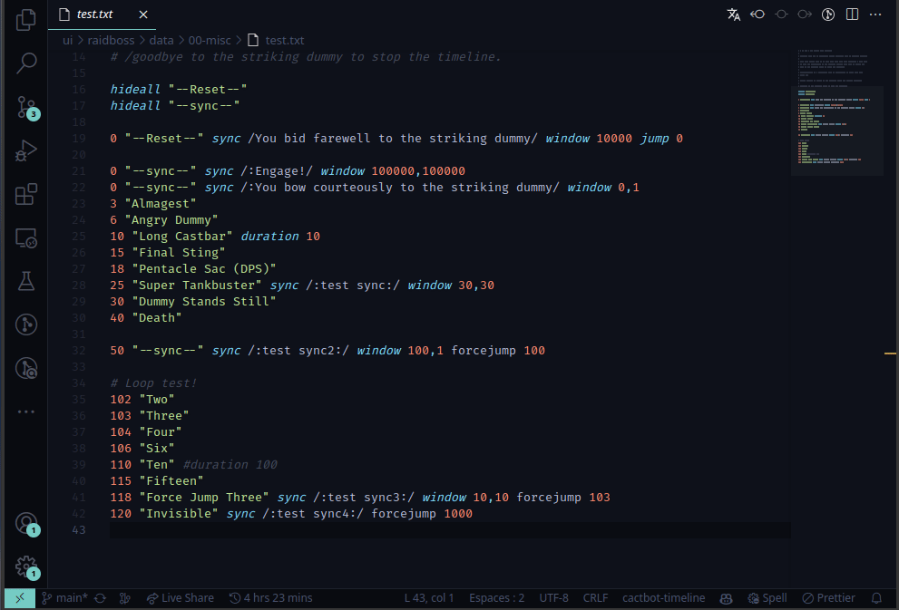
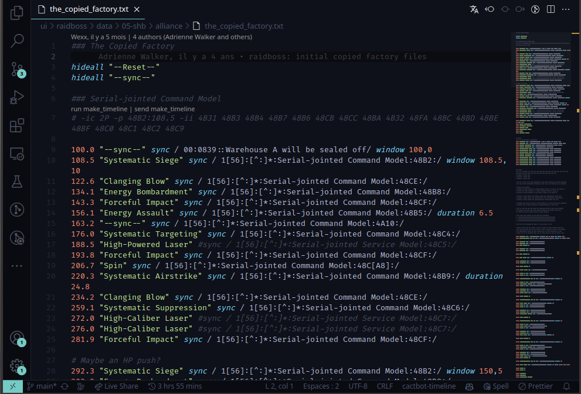

# Cactbot Highlight

<a href="https://marketplace.visualstudio.com/items?itemName=MaikoTan.cactbot-highlight" target="_blank"></img></a>

[](https://marketplace.visualstudio.com/items?itemName=MaikoTan.cactbot-highlight)
[](https://marketplace.visualstudio.com/items?itemName=MaikoTan.cactbot-highlight)
[](https://open-vsx.org/extension/MaikoTan/cactbot-highlight)
[](https://open-vsx.org/extension/MaikoTan/cactbot-highlight)


[](https://github.com/MaikoTan/cactbot-highlight/actions/workflows/build.yml)
[](https://github.com/MaikoTan/cactbot-highlight/actions/workflows/eslint.yml)
[](https://github.com/MaikoTan/cactbot-highlight/actions/workflows/test.yml)

A VSCode extension for developing [cactbot](https://github.com/OverlayPlugin/cactbot/) modules.

<!-- AUTO-GENERATED-CONTENT:START (TOC:maxDepth=4) -->
- [Features](#features)
  - [Raidboss Timeline](#raidboss-timeline)
    - [Syntax Highlight](#syntax-highlight)
    - [Time Adjustment](#time-adjustment)
    - [Translation Validation](#translation-validation)
  - [Raidboss Triggers](#raidboss-triggers)
    - [Code Snippets](#code-snippets)
- [FAQ](#faq)
- [Localisation](#localisation)
- [Contributing](#contributing)
- [License](#license)
<!-- AUTO-GENERATED-CONTENT:END -->

## Features

### [Raidboss](https://github.com/OverlayPlugin/cactbot#raidboss-overlay) Timeline

#### Syntax Highlight

If you didn't see the syntax highlight in your timeline files,
please check the [FAQ](https://github.com/MaikoTan/cactbot-highlight/blob/master/FAQ.md#why-isnt-my-timeline-files-not-highlighted).

#### Time Adjustment



#### Translation Validation



To use this feature, you should make sure your active file
is a valid timeline file or trigger file that there are a valid
timeline file which has the same name in the same directory,
also make sure you are in the cactbot repository.

Click the `Translate Current Timeline` button on the top-right corner to translate the active file.

### [Raidboss](https://github.com/OverlayPlugin/cactbot#raidboss-overlay) Triggers

#### Code Snippets

<table>
<thead>
<tr>
<th>Snippet</th>
<th>Example</th>
</thead>
<tbody>
<tr>
<td>
<code>ca-r-init</code>
<br>
initiate a complete trigger set</td>
<td>

```ts
import ZoneId from '../../../../../resources/zone_id'
import { RaidbossData } from '../../../../../types/data'
import { TriggerSet } from '../../../../../types/trigger'

export type Data = RaidbossData

const triggerSet: TriggerSet<Params> = {
  zoneId: ZoneId.TheBindingCoilOfBahamutTurn4,
  timelineFile: 't13.txt',
  timelineTriggers: [],
  triggers: [],
  timelineReplace: [],
}

export default triggerSet
```

</td>
</tr>
<tr>
<td>
<code>ca-r-timeline-trigger</code>
<br>
initiate a timeline trigger</td>
<td>

```ts
{
  id: 'T13 Phase 2',
  regex: /Regex/,
  beforeSeconds: 5,
}
```

</td>
</tr>
<tr>
<td>
<code>ca-r-trigger</code>
<br>
initiate a trigger</td>
<td>

```ts
{
  id: 'T13 Gigaflare',
  type: 'Ability',
  netRegex: NetRegexes.ability({ }),
},
```

</td>
</tr>
<tr>
<td>
<code>ca-r-timeline-replace</code>
<br>
initiate a timeline replace section</td>
<td>

```ts
{
  'locale': 'de',
  'replaceSync': {},
  'replaceText': {},
},
```

</td>
</tr>
<tr>
<td>
<code>ca-r-timeline-replace-all</code>
<br>
initiate timeline replace <br>
sections with all languages</td>
<td>

```ts
{
  'locale': 'en',
  'replaceSync': {},
  'replaceText': {},
},
{
  'locale': 'de',
  'missingTranslations': true,
  'replaceSync': {},
  'replaceText': {},
},
// ...
{
  'locale': 'ko',
  'missingTranslations': true,
  'replaceSync': {},
  'replaceText': {},
},
```

</td>
</tr>
</tbody>
</table>

## FAQ

You can find the FAQ in [FAQ.md](https://github.com/MaikoTan/cactbot-highlight/blob/master/FAQ.md).

## Localisation

This extension supports multi-language.

Translators are listed below. Thanks for your contribution!

[](https://crowdin.com/project/cactbot-highlight)

- English (US) - [@MaikoTan](https://github/MaikoTan)
- Simplified Chinese - [@ShadyWhite](https://github.com/ShadyWhite) [@DeepseaXX](https://github.com/DeepseaXX)
- Traditional Chinese - [@MaikoTan](https://github.com/MaikoTan)
- Japanese - [@MaikoTan](https://github.com/MaikoTan) [@DeepseaXX](https://github.com/DeepseaXX)
- French - [@MaikoTan](https://github.com/MaikoTan) [@wuasar42](https://crowdin.com/profile/wuasar42)
- Korean - [@Bing-su](https://github.com/Bing-su)

If you want to add a new language, or contribute to the existing ones,
please visit [our project on Crowdin](https://crowdin.com/project/cactbot-highlight).

If you want to add a new language, you should make sure that the language is supported by VSCode officially.
You can search for the language name in the Extensions Marketplace,
or access [microsoft/vscode-loc](https://github.com/microsoft/vscode-loc) to see if your language is supported or not.

## Contributing

See [CONTRIBUTING.md](CONTRIBUTING.md)

## License

This project is licensed under the MIT license,
see [LICENSE](LICENSE.md) for more detail.
