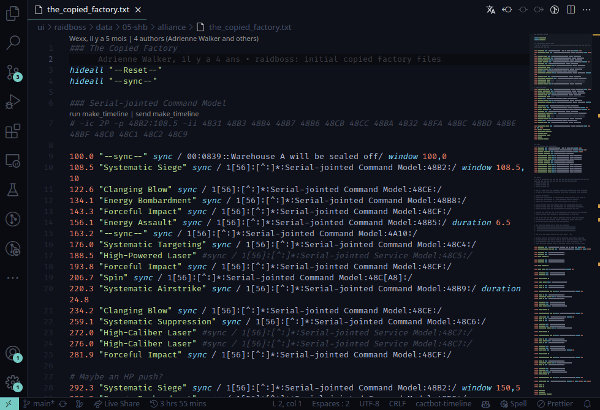

# cactbot-highlight

[](https://marketplace.visualstudio.com/items?itemName=MaikoTan.cactbot-highlight)

A custom extension for developing [cactbot](https://github.com/quisquous/cactbot/) modules.

## Index

- [Features](#features)
- [Install](#install)
  - [Install from VSIX](#install-from-vsix)
  - [Enable it in cactbot](#enable-it-in-cactbot)
  - [Available Settings](#available-settings)
  - [How to build your own](#how-to-build-your-own)
- [Known Issues](#known-issues)
- [Contributing](#contributing)

## Features

### timeline highlight


> uwu timeline with Monakai color theme

### adjust time


### translate timeline



### useful snippets

> snippets in trigger.js files


## Install

If you got troubles when install from Visual Studio Market,
you can install `cactbot-highlight` manually:

### Install from VSIX

- Download the latest release `cactbot-highlight-x.x.x.vsix` from [Release](https://github.com/MaikoTan/cactbot-highlight/releases)

- Launch VSCode and switch to `Extensions` tab

- Click the `Views and More Actions...` (3-dots) button, select `Install from VSIX...`

- Enjoy ~

### Enable it in cactbot

If you're using this extension in the repo that you clone from quisquous's branch,
this feature is already **enabled by default**, because we add a default settings in `.vscode` directory.

But if you're using this extension out of a repo, you *might* need to enable it manually.

> Because cactbot timeline file is `*.txt`,
> VSCode would recognize it as `Plain Text` before the extension enabled.

- Enable it for a single file

Click `Plain Text` button at right bottom,
select `cactbot-timeline` in the prompt window.

- Enable it for the whole workspace

Create `.vscode/settings.json` if you have no this file.

Add this below to the file.

```json
{
    "files.associations": {
        "**/data/**/*.txt": "cactbot-timeline"
    }
}
```

### Available Settings

#### Via GUI

Under `Settings -> Extensions -> cactbot-highlight`,
you can configure this extension.

#### Via .vscode/settings.json file

```json
// Set default locale for timelines. If this property is set, a prompt would not shown.
// value can be: [ "de","fr","ja","cn","ko" ]
"cactbot.timeline.defaultLocale": "ja",
```

### How to build your own

- Install [Node.js](https://nodejs.org/) and [Yarn](https://yarnpkg.com/)

- Download source code

- Run the commands below

```bash
yarn install
yarn run compile
```

- Press <kbd>F5</kbd> for executing.

## Known Issues

Timeline highlighting is incomplete.

Need more snippets in other files.

## Contributing

See: [CONTRIBUTING.md](CONTRIBUTING.md)